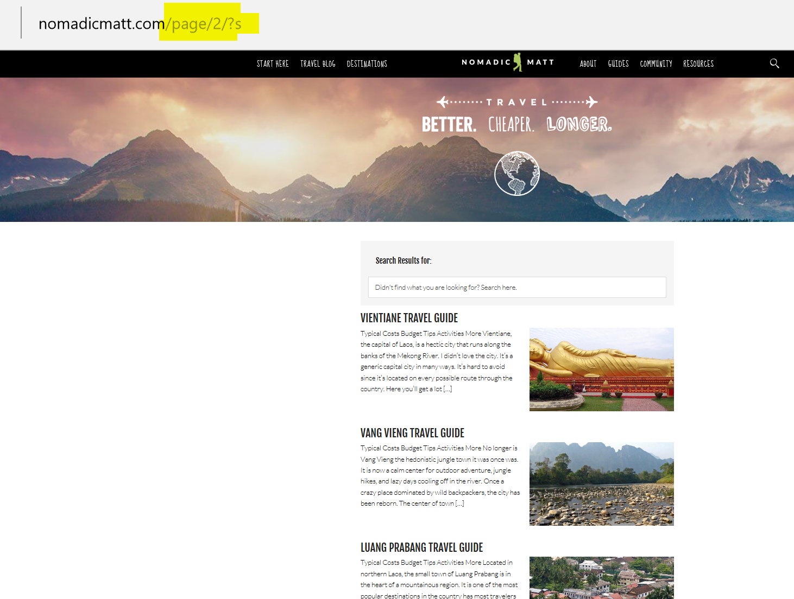
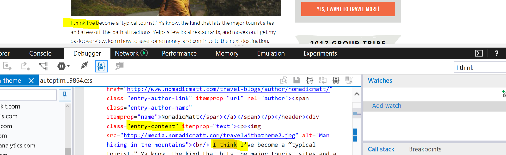
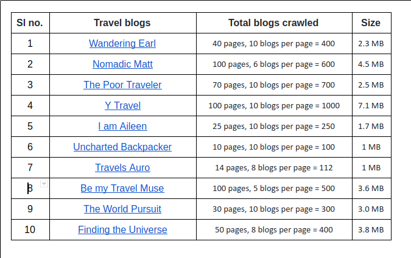

# Website crawler

Python Crawler for Wordpress travel blogs

I have written a simple crawler using [Beautiful Soup](https://www.crummy.com/software/BeautifulSoup/) (a python library) to extract text content from top travel blogs written using [wordpress](https://wordpress.com/). 

Blogs that have been written with wordpress share almost the same HTML structure. For example, let's take a look at [Nomadic Matt’s](http://www.nomadicmatt.com/) blog: 


    
Every page has a fixed number of blogs. The crawler first extracts links to the blogs from each page.  Once you click on a blog, all the content can be found in the CSS container labelled with “entry-content”. The crawler then extracts this content from each blog.



## Running the crawler
Open a terminal, navigate to the project directory and type the below command:

    python crawler.py
  
It crawls blog content from 10 blogs and writes to ```blog.txt```. Below are the details of blogs crawled:


## Improvements
Crawl all travel blogs, mentioned in [blogsToCrawl.txt](blogsToCrawl.txt)

## References
[Writing travel blogs with deep learning](https://medium.com/intuitionmachine/writing-travel-blogs-with-deep-learning-9b4a6fbcc87)
